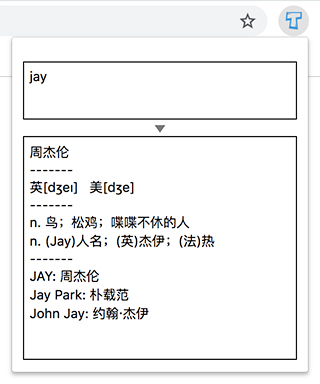

# chrome-plugin-translate

这可能是东半球最清爽高效的chrome翻译插件

## Feature

English：
- default hotkey: `Shift+Alt+Y`
- easy-to-use: `auto focus` textarea -> input -> press Enter
- support long sentences
- auto recognition language

中文：
- 默认快捷键：`Shift+Alt+Y`
- 简单易用：自动焦点输入框 -> 输入文本 -> 敲回车
- 支持长句子
- 自动识别语言

## Install

1. Download the [zip](https://github.com/seasidesun/chrome-plugin-translate/archive/master.zip) file and unzip

2. Go to chrome://extensions/ and check the box for Developer mode in the top right.

3. Click the Load unpacked extension button in the top left and select the unzipped folder

## Screenshot



### Tip for chrome plugin develop

If the plugin open the popup with delay, try to add the file: `backgroud.html`, and upadte the `manifest.json`

```
//manifest.json

...
"background": {
    "page": "background.html",
    "persistent": true
},
...
```
